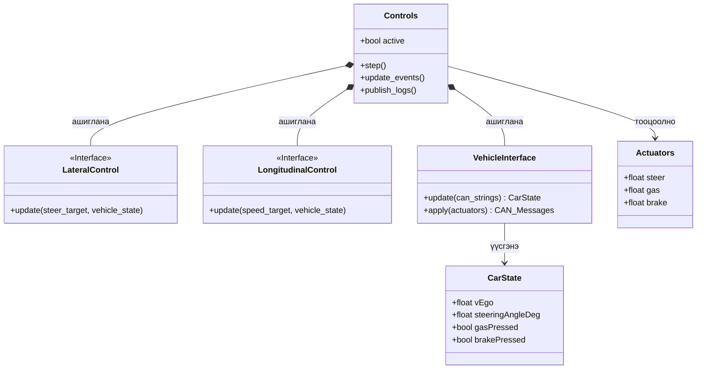

```mermaid
classDiagram
    class Controls {
        +bool active
        +step()
        +update_events()
        +publish_logs()
    }
    class LateralControl {
        <<Interface>>
        +update(steer_target, vehicle_state)
    }
    class LongitudinalControl {
        <<Interface>>
        +update(speed_target, vehicle_state)
    }
    class VehicleInterface {
        +update(can_strings) CarState
        +apply(actuators) CAN_Messages
    }
    class CarState {
        +float vEgo
        +float steeringAngleDeg
        +bool gasPressed
        +bool brakePressed
    }
    class Actuators {
        +float steer
        +float gas
        +float brake
    }

    Controls *-- LateralControl : ашиглана
    Controls *-- LongitudinalControl : ашиглана
    Controls *-- VehicleInterface : ашиглана
    VehicleInterface --> CarState : үүсгэнэ
    Controls --> Actuators : тооцоолно
```
