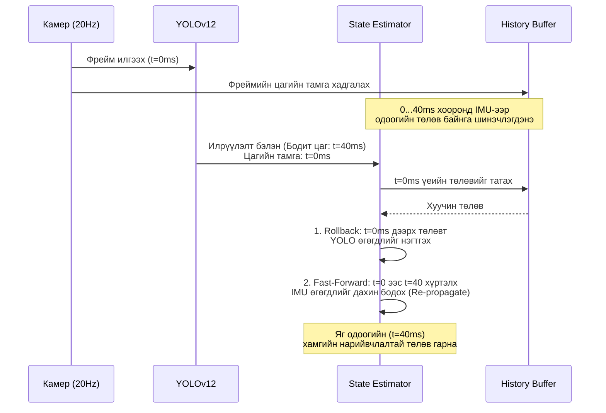

```mermaid
sequenceDiagram
    participant Cam as Камер (20Hz)
    participant YOLO as YOLOv12
    participant EKF as State Estimator
    participant Buffer as History Buffer
    
    Cam->>YOLO: Фрейм илгээх (t=0ms)
    Cam->>Buffer: Фреймийн цагийн тамга хадгалах
    
    Note over EKF, Buffer: 0...40ms хооронд IMU-ээр<br/>одоогийн төлөв байнга шинэчлэгдэнэ
    
    YOLO->>EKF: Илрүүлэлт бэлэн (Бодит цаг: t=40ms)<br/>Цагийн тамга: t=0ms
    
    EKF->>Buffer: t=0ms үеийн төлөвийг татах
    Buffer-->>EKF: Хуучин төлөв
    
    EKF->>EKF: 1. Rollback: t=0ms дээрх төлөвт<br/>YOLO өгөгдлийг нэгтгэх
    EKF->>EKF: 2. Fast-Forward: t=0 ээс t=40 хүртэлх<br/>IMU өгөгдлийг дахин бодох (Re-propagate)
    
    Note over EKF: Яг одоогийн (t=40ms)<br/>хамгийн нарийвчлалтай төлөв гарна
```
