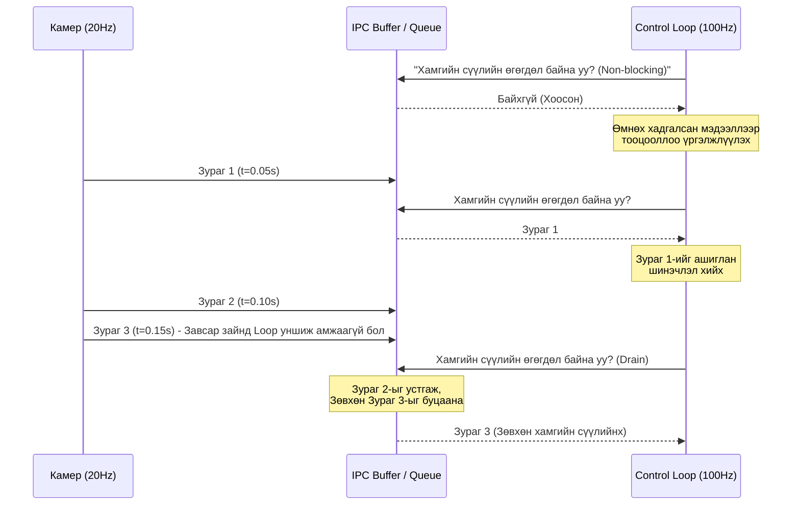

```mermaid
sequenceDiagram
    participant Sensor as Камер (20Hz)
    participant Buffer as IPC Buffer / Queue
    participant CtrlLoop as Control Loop (100Hz)

    CtrlLoop->>Buffer: "Хамгийн сүүлийн өгөгдөл байна уу? (Non-blocking)"
    Buffer-->>CtrlLoop: Байхгүй (Хоосон)
    Note over CtrlLoop: Өмнөх хадгалсан мэдээллээр<br/>тооцооллоо үргэлжлүүлэх
    
    Sensor->>Buffer: Зураг 1 (t=0.05s)
    
    CtrlLoop->>Buffer: Хамгийн сүүлийн өгөгдөл байна уу?
    Buffer-->>CtrlLoop: Зураг 1
    Note over CtrlLoop: Зураг 1-ийг ашиглан<br/>шинэчлэл хийх
    
    Sensor->>Buffer: Зураг 2 (t=0.10s)
    Sensor->>Buffer: Зураг 3 (t=0.15s) - Завсар зайнд Loop уншиж амжаагүй бол
    
    CtrlLoop->>Buffer: Хамгийн сүүлийн өгөгдөл байна уу? (Drain)
    Note over Buffer: Зураг 2-ыг устгаж,<br/>Зөвхөн Зураг 3-ыг буцаана
    Buffer-->>CtrlLoop: Зураг 3 (Зөвхөн хамгийн сүүлийнх)
```
