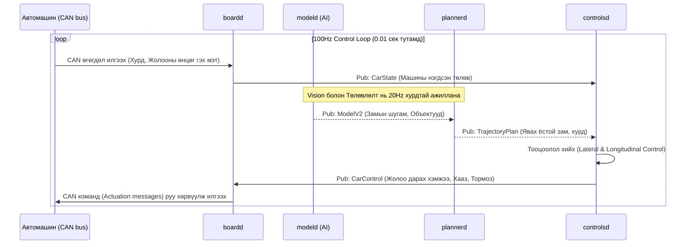

```mermaid
sequenceDiagram
    participant Car as Автомашин (CAN bus)
    participant boardd as boardd
    participant modeld as modeld (AI)
    participant plannerd as plannerd
    participant controlsd as controlsd

    loop 100Hz Control Loop (0.01 сек тутамд)
        Car->>boardd: CAN өгөгдөл илгээх (Хурд, Жолооны өнцөг гэх мэт)
        boardd->>controlsd: Pub: CarState (Машины нэгдсэн төлөв)
        
        Note over modeld,plannerd: Vision болон Төлөвлөлт нь 20Hz хурдтай ажиллана
        modeld-->>plannerd: Pub: ModelV2 (Замын шугам, Объектууд)
        plannerd-->>controlsd: Pub: TrajectoryPlan (Явах ёстой зам, хурд)
        
        controlsd->>controlsd: Тооцоолол хийх (Lateral & Longitudinal Control)
        controlsd->>boardd: Pub: CarControl (Жолоо дарах хэмжээ, Хааз, Тормоз)
        boardd->>Car: CAN команд (Actuation messages) руу хөрвүүлж илгээх
    end
```
