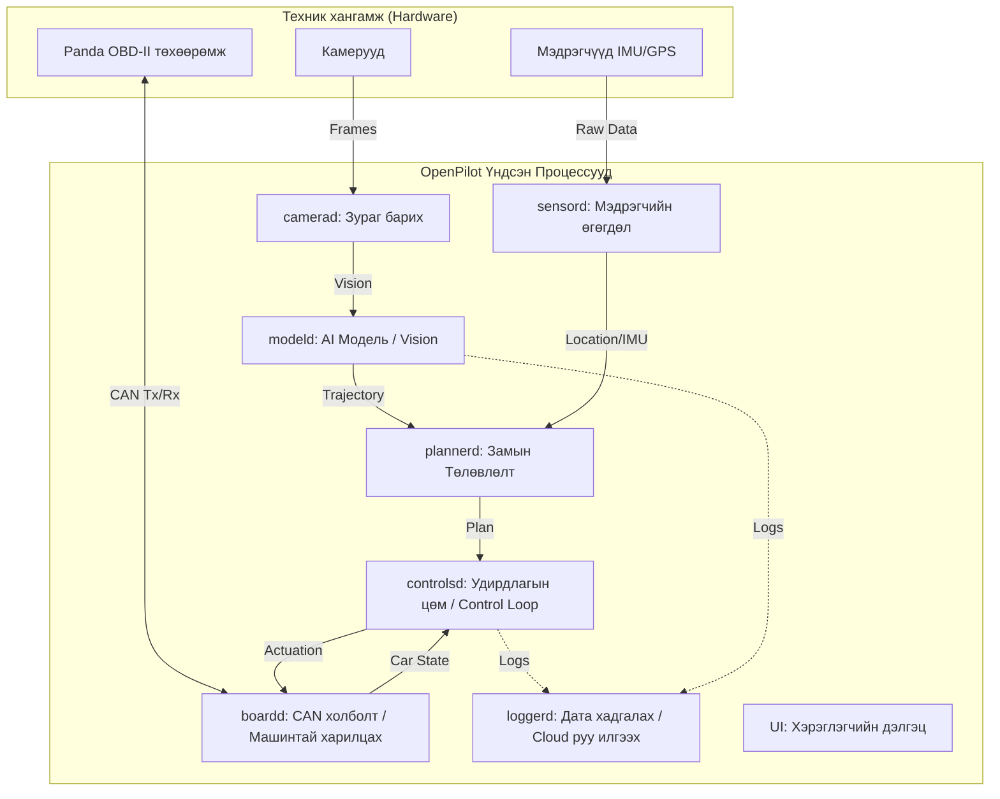

```mermaid
graph TD
    subgraph Hardware["Техник хангамж (Hardware)"]
        Camera[Камерууд]
        Panda[Panda OBD-II төхөөрөмж]
        Sensors[Мэдрэгчүүд IMU/GPS]
    end

    subgraph OpenPilot_Daemons["OpenPilot Үндсэн Процессууд"]
        camerad[camerad: Зураг барих]
        sensord[sensord: Мэдрэгчийн өгөгдөл]
        boardd[boardd: CAN холболт / Машинтай харилцах]
        modeld[modeld: AI Модель / Vision]
        plannerd[plannerd: Замын Төлөвлөлт]
        controlsd[controlsd: Удирдлагын цөм / Control Loop]
        loggerd[loggerd: Дата хадгалах / Cloud руу илгээх]
        ui[UI: Хэрэглэгчийн дэлгэц]
    end

    Camera -->|Frames| camerad
    Panda <-->|CAN Tx/Rx| boardd
    Sensors -->|Raw Data| sensord

    camerad -->|Vision| modeld
    modeld -->|Trajectory| plannerd
    sensord -->|Location/IMU| plannerd
    boardd -->|Car State| controlsd
    plannerd -->|Plan| controlsd
    controlsd -->|Actuation| boardd

    controlsd -.->|Logs| loggerd
    modeld -.->|Logs| loggerd
```
